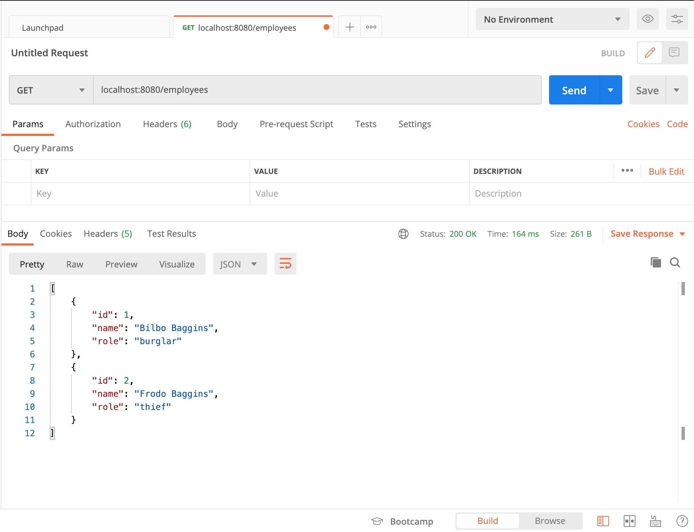
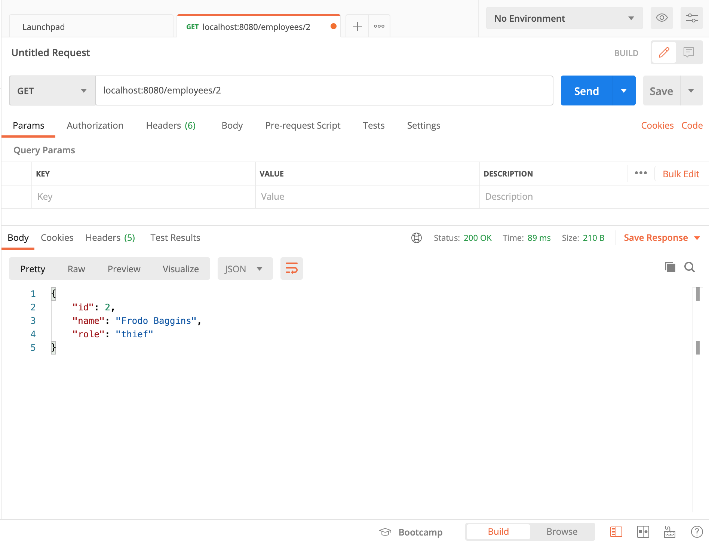
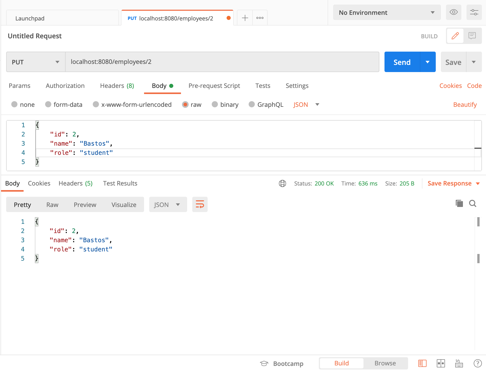
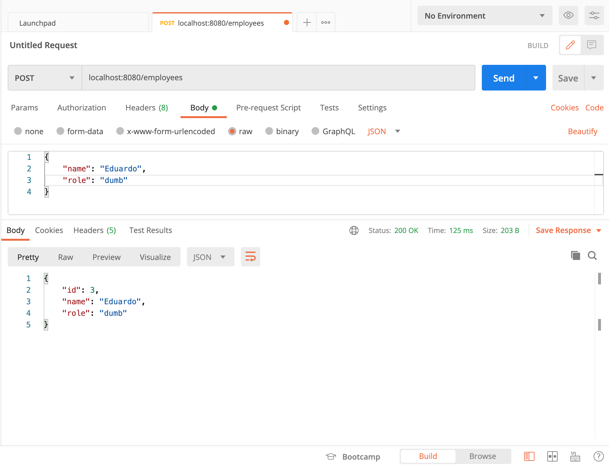
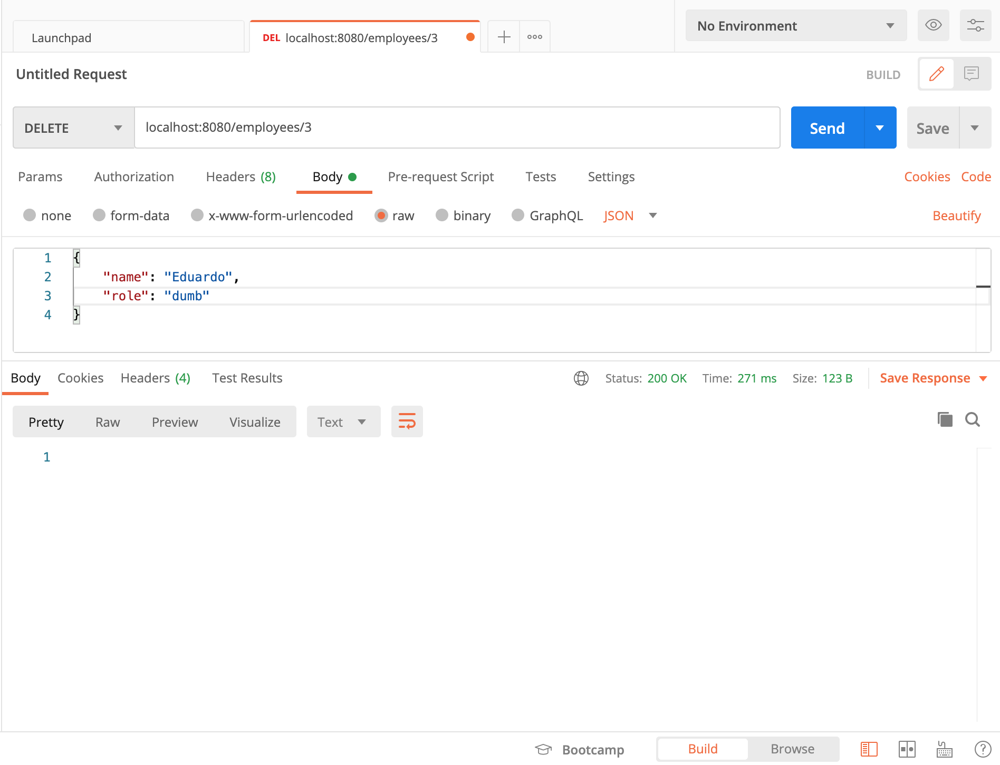
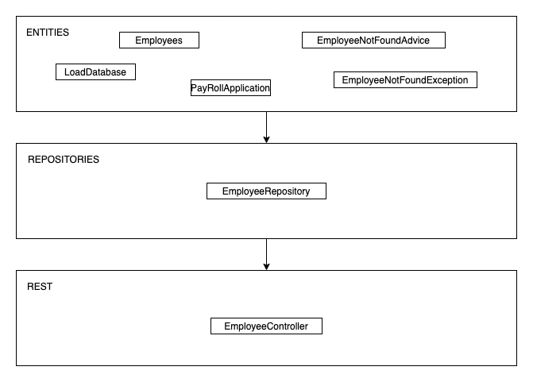

## 3.1

### Be sure to list all, filter one, insert and update Employees, i.e., try the several web methods. Take note of the URL used and report in the Readme.
* Get a list with all the employees:
	* ENDPOINT: `http://localhost:8080/employees`
	* METHOD: GET

* Lists employee with id 1:
	* ENDPOINT: `http://localhost:8080/employees/1`
	* METHOD: GET

* Changing employee:
	* ENDPOINT: `http://localhost:8080/employees/2`
	* METHOD: PUT

* Adding a new employee:
	* ENDPOINT: `http://localhost:8080/employees`
	* METHOD: POST

* Deleting an employee:
	* ENDPOINT: `http://localhost:8080/employees/3`
	* METHOD: DELETE

### What happens to your data when the application is stoppedand restarted? How could you change that behavior?
All changes get deleted and the application restarts the unchanged version, the original list of employees.
When we run the application, the LoadDatabase class is called, loading only the 2 pre-loaded items. This is because when we make changes by requests, it is actually changing in the REST instance and not in the actual DB. 
The solution is to implement a DB that is decoupled from the REST API so that when we change the employees, it is actually changing the DB.

### What would be the proper HTTP Status code to get when searching an API for non-existent `http://localhost:8080/employees/987987`?
Since the employee doesn't exist and we have an EmployeeNotFoundException class, it shows that the employee could not be found. The HTTP satus code is:
> 404 Not Found

### Create alayeredarchitecture view(UML diagram), displaying the key abstractions in the solution, in particular: entities, repositories and REST controllers.

### Describe the role of the elements modeled in the previous point.
* Employee:
	* Represents an employee
	* Has constructor, getters and setter
	* @Id and @GeneratedValue allows it to auto-generate an incremented id
* LoadDatabase:
	* Automatically runs once the application starts. It allows to preload 2 new employees using the EmployeeRepository class
* PayRollApplication:
	* Runs the application with all the configurations and dependencies needed.
* EmployeeNotFoundApplication
	* Contains a message to return in case of 404
* EmployeeNotFoundAdvice
	* SpringBoot's auto response that gets the message in EmployeeNotFoundApplication and shows it
* EmployeeRepository:
	* Stores the employees in the DB
* EmployeeController:
	* Handles the HTTP requests and returns the result

